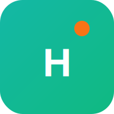

<div align="center">
  
  
  # HealthLens
  **AI-Powered Health Education & Triage Platform**
  
  [](https://nextjs.org/)
  [](https://supabase.com/)
  [](https://clerk.dev/)
  [](https://groq.com/)
  [](https://deepmind.google/technologies/gemini/)
  [](https://tailwindcss.com/)
</div>

<br />

## 🚨 The Problem
In rural and developing regions, the doctor-to-patient ratio heavily limits access to immediate healthcare advice. Patients often travel long distances or wait hours in crowded clinics just to receive basic diagnosis or triage information. 

## 💡 The Solution: HealthLens
HealthLens is a **Progressive Web App (PWA)** that puts a preliminary, multilingual AI doctor in the pocket of every patient. It securely analyzes text symptoms and visual conditions (rashes, skin lesions) to provide instant health education, self-care tips, and critical triage advice—including a built-in **Red Flag Emergency System** that intercepts life-threatening symptoms before they even reach the AI.

---

## ✨ Key Features

- 🏥 **Red Flag Emergency Engine:** A deterministic local rules-engine that instantly detects critical terms (e.g., "chest pain", "can't breathe") and bypasses the AI completely to direct the user to an emergency room.
- ⚡ **Ultra-Fast Symptom Checker:** Powered by **Groq (Llama 3)**, delivering comprehensive medical educational reports in milliseconds.
- 👁️ **Visual Symptom Scanner:** Powered by **Google Gemini 1.5 Pro Vision**, allowing users to securely upload photos of skin conditions or injuries for AI pedagogical analysis.
- 🌐 **Full Multilingual Support:** Deep translation integration for **7 regional languages** (Hindi, Bengali, Tamil, Telugu, Kannada, Marathi, English) to serve diverse demographics.
- 📱 **Native PWA Experience:** "Install to Home Screen" capability with offline fallback support, critical for rural users with spotty internet coverage.
- 🎤 **Voice-to-Text & Text-to-Speech:** Accessible chat interface allowing illiterate or visually impaired patients to converse with the AI using their voice.
- 🔒 **Enterprise-Grade Security:** Authentication via **Clerk** and HIPAA-compliant-ready architecture using **Supabase** (PostgreSQL) with Row Level Security (RLS).

---

## 🛠️ Architecture & Tech Stack

### Frontend
- **React 18 & Next.js 14** (App Router)
- **Tailwind CSS & Framer Motion** (Mobile-First, fully responsive UI)
- **Progressive Web App (PWA)** (Service Workers, Offline Caching)

### Backend & Database
- **Next.js Route Handlers** (Serverless backend API)
- **Supabase (PostgreSQL)** (Patient history, chat logs, appointments, secure data storage)
- **Clerk** (Secure JWT-based authentication)

### AI Middleware
- **Groq API (Llama 3 8B)** -> High-speed text-based symptom analysis and chat.
- **Google Gemini API (Gemini 1.5 Pro Vision)** -> Advanced multimodal image analysis.

---

## 🚀 Getting Started (Local Development)

1. **Clone the repository:**
   ```bash
   git clone https://github.com/binodbishwakarama-max/Aihealth.git
   cd Aihealth
   ```

2. **Install dependencies:**
   ```bash
   npm install
   ```

3. **Set up Environment Variables:**
   Create a `.env.local` file in the root directory and add the following keys:
   ```env
   # Clerk Auth
   NEXT_PUBLIC_CLERK_PUBLISHABLE_KEY=your_clerk_key
   CLERK_SECRET_KEY=your_clerk_secret

   # Supabase Database
   NEXT_PUBLIC_SUPABASE_URL=your_supabase_url
   NEXT_PUBLIC_SUPABASE_ANON_KEY=your_supabase_anon_key
   SUPABASE_SERVICE_ROLE_KEY=your_supabase_service_role

   # AI Providers
   GROQ_API_KEY=your_groq_key
   GEMINI_API_KEY=your_gemini_key
   ```

4. **Run the development server:**
   ```bash
   npm run dev
   ```
   Open `http://localhost:3000` in your browser.

---

## 📱 PWA Testing
To test the Progressive Web App features on a mobile device:
1. Deploy the app to Vercel (or expose localhost via ngrok).
2. Open the URL in Chrome (Android) or Safari (iOS).
3. Tap **"Add to Home Screen"**.
4. Test offline mode by turning on Airplane mode and relaunching the app.

---

## ⚠️ Disclaimer
*HealthLens is designed strictly for educational and informational purposes. It is not a substitute for professional medical advice, diagnosis, or treatment. Always seek the advice of your physician or other qualified health provider with any questions you may have regarding a medical condition.*

<br/>
<div align="center">
  <i>Built with ❤️ for better global healthcare.</i>
</div>
