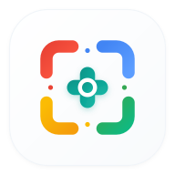
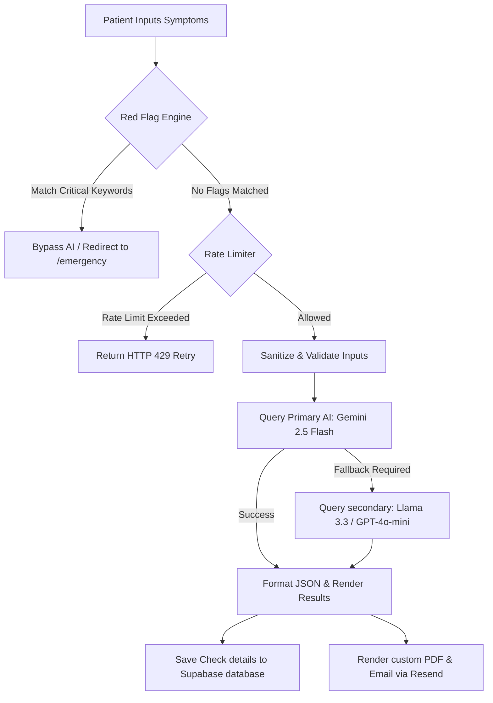

<div align="center">
  
  
  # HealthLens
  **AI-Powered Health Education, Visual Triage & Clinic Booking Platform**
  
  [](https://aihealth-ijnb.vercel.app/)
  [](https://github.com/binodbishwakarama-max/Aihealth)
  
  [](https://nextjs.org/)
  [](https://react.dev/)
  [](https://tailwindcss.com/)
  [](https://supabase.com/)
  [](https://clerk.dev/)
  [](https://deepmind.google/technologies/gemini/)
</div>

<br />

## 🚨 The Problem
In developing regions and rural communities, extreme doctor-to-patient ratios restrict access to fast medical advice. Patients must travel long distances or wait in crowded clinics just to receive basic diagnosis or triage information. 

## 💡 The Solution: HealthLens
**HealthLens** is a **Progressive Web App (PWA)** that places a preliminary, multilingual AI health educator in the pocket of every patient. It securely analyzes symptoms and visual conditions (rashes, skin lesions) to provide instant pedagogical guidance, self-care tips, and critical triage advice—supported by a deterministic **Red Flag Emergency Engine** that intercepts life-threatening situations immediately, bypassing the AI to guide users to nearest emergency clinics.

---

## ⚡ Core Workflows & Architecture

### Triage & Analysis Pipeline

```mermaid
graph TD
    A[Patient Inputs Symptoms] --> B{Red Flag Engine}
    B -- Match Critical Keywords --> C[Bypass AI / Redirect to /emergency]
    B -- No Flags Matched --> D{Rate Limiter}
    D -- Rate Limit Exceeded --> E[Return HTTP 429 Retry]
    D -- Allowed --> F[Sanitize & Validate Inputs]
    F --> G[Query Primary AI: Gemini 2.5 Flash]
    G -- Success --> H[Format JSON & Render Results]
    G -- Fallback Required --> I[Query secondary: Llama 3.3 / GPT-4o-mini]
    I --> H
    H --> J[Save Check details to Supabase database]
    H --> K[Render custom PDF & Email via Resend]
```

---

## ✨ Key Features

- 🏥 **Deterministic Red Flag Engine:** A local engine ([`redFlagEngine.ts`](file:///c:/Users/binod/Downloads/Aihealth/src/lib/redFlagEngine.ts)) intercepts inputs. If critical keywords or high-severity signals (e.g., chest pain with breathlessness, stiff neck with high fever) match, it directs patients directly to the `/emergency` hotline.
- ⚡ **AI Symptom Checker:** Detailed symptom evaluation using **Google Gemini 2.5 Flash** (with fallbacks to **Groq Llama 3.3 70B** and **OpenAI GPT-4o-mini**), yielding possible conditions, risk assessments, and wellness tips.
- 👁️ **Visual Symptom Scanner:** Multimodal visual analysis powered by **Google Gemini 2.5 Flash Vision** (with **GPT-4o-mini Vision** fallback). Patients can upload images of rashes or injuries to receive clinical observations.
- 💬 **Interactive AI Health Chat:** Follow-up conversation contextually linked to checked symptoms, utilizing **Gemini 2.0 Flash** for natural dialogues.
- 📅 **Google Calendar Appointment Booking:** Complete scheduling workflow (`/book`). Integrates with the **Google Calendar API** to book slots, add descriptions, locations, and generate video consultation calendar links, saving appointment states in Supabase.
- 📍 **Nearby Health Services Geoclocator:** Uses browser coordinates and the **Google Maps Places API** to find hospitals, clinics, and ambulance facilities within a 5km radius, with dynamic maps directions.
- 📄 **PDF Export & Resend Ingestion:** Compiles reports into medical sheets using client-side `jspdf` and emails them as attachments via **Resend**.
- 🌐 **7 Regional Languages Supported:** Real-time translation (English, Hindi, Bengali, Tamil, Telugu, Kannada, Marathi) with custom prompting to return AI responses in the selected language.
- 🔒 **Enterprise-Grade Admin Panel:** Clerk authenticated console displaying daily symptom trends (via Supabase database views) and scheduling data, with a white-label settings page to adjust colors, name, and logos in realtime.

---

## 🛠️ Technology Stack

| Layer | Technology | Details |
| :--- | :--- | :--- |
| **Frontend Framework** | **React 19 & Next.js 16 (App Router)** | State-of-the-art React rendering and optimized serverless page routers. |
| **Styling** | **Tailwind CSS v4 & Framer Motion** | Glassmorphism mobile-first system with fluid animations. |
| **Database** | **Supabase (PostgreSQL)** | Persistent storage for logs, appointments, and configuration. |
| **Authentication** | **Clerk** | Secure JWT user credentials. |
| **AI Providers** | **Gemini 2.5 Flash, Llama 3.3, GPT-4o-mini** | Multi-vendor fallback pipeline for prompt execution and vision. |
| **API integrations** | **Google Calendar, Google Places, Resend** | Calendar scheduling, geolocators, and email attachments. |

---

## 🛡️ Security & Safeguards

- **Input Sanitization:** Strips HTML/JS scripts, enforces strict length bounds, and sanitizes numbers (age, severity) to prevent injection risks ([`security.ts`](file:///c:/Users/binod/Downloads/Aihealth/src/lib/security.ts)).
- **API Rate Limiting:** Sliding-window limiter (10 req/min per IP) protects AI endpoints.
- **Row Level Security (RLS):** Supabase DB queries secure patient details (`symptom_checks`, `appointments`) by binding select statements to Clerk JWT claims.
- **Local Rules Engine:** Red flag interceptor runs local Javascript functions, bypassing network roundtrips for emergencies.

---

## 💾 Database Schema

The database consists of three main tables and a dynamic analytics view:
1. **`symptom_checks`**: Stores patient symptom history, duration, severity, computed risk, and AI JSON responses.
2. **`appointments`**: Manages patient bookings, contact records, statuses, and Google Calendar event URLs.
3. **`settings`**: Provides app configuration for white-label styling (app name, colors, custom logos).
4. **`daily_symptom_stats`** (View): Aggregates daily telemetry data for the admin console.

*The full SQL schema is defined in [`supabase/schema.sql`](file:///c:/Users/binod/Downloads/Aihealth/supabase/schema.sql).*

---

## 🚀 Getting Started (Local Development)

### 1. Clone the repository
```bash
git clone https://github.com/binodbishwakarama-max/Aihealth.git
cd Aihealth
```

### 2. Install dependencies
```bash
npm install
```

### 3. Setup Environment Variables
Create a `.env.local` file in the root directory:
```env
# Clerk Auth Configuration
NEXT_PUBLIC_CLERK_PUBLISHABLE_KEY=pk_test_...
CLERK_SECRET_KEY=sk_test_...

# Supabase Postgres Settings
NEXT_PUBLIC_SUPABASE_URL=https://your-supabase-project.supabase.co
NEXT_PUBLIC_SUPABASE_ANON_KEY=eyJhbGciOi...
SUPABASE_SERVICE_ROLE_KEY=eyJhbGciOi...

# AI Keys
GEMINI_API_KEY=AIzaSy...
GROQ_API_KEY=gsk_...
OPENAI_API_KEY=sk-proj-...

# Google APIs (Maps & Calendar Integration)
GOOGLE_CLIENT_ID=your-google-client-id
GOOGLE_CLIENT_SECRET=your-google-client-secret
GOOGLE_REDIRECT_URI=http://localhost:3000/api/auth/google/callback
GOOGLE_MAPS_API_KEY=AIzaSy...

# Email Integrations
RESEND_API_KEY=re_...

# Admin Config (Comma-separated IDs or Emails)
ADMIN_USER_IDS=user_...
ADMIN_EMAILS=admin@healthlens.com
```

### 4. Run the Development Server
```bash
npm run dev
```
Open [http://localhost:3000](http://localhost:3000) to view the application locally.

---

## ⚠️ Disclaimer
*HealthLens is designed strictly for educational and informational purposes. It is not a substitute for professional medical advice, diagnosis, or treatment. Always seek the advice of your physician or other qualified health provider with any questions you may have regarding a medical condition. In case of an emergency, call your local emergency number immediately.*

<br/>
<div align="center">
  <i>Built with ❤️ for accessible global healthcare.</i>
</div>
